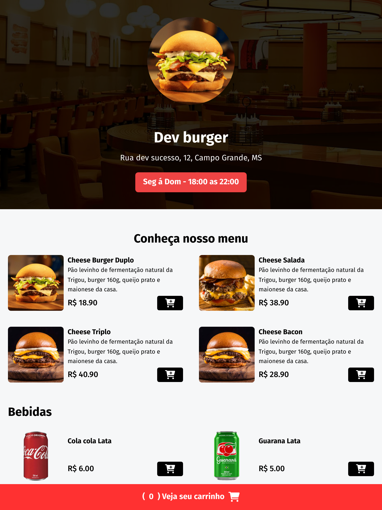

# Dev Burger

## 📍️ Index

- [Dev Burger](#dev-burger)
  - [📍️ Index](#📍️-index)
  - [📖️ Sobre](#📖️-sobre)
  - [📷️ Preview](#📷️-preview)
  - [🚀️ Tecnologias](#🚀️-tecnologias)
  - [🔖️ Layout](#🔖️-layout)
  - [📝️ Licença](#📝️-licença)

## 📖️ Sobre

O projeto foi desenvolvido com o intuito de praticar o desenvolvimento de interfaces web, utilizando HTML, CSS e JavaScript, além de explorar o framework Tailwind CSS a API do WhatsApp para criar um cardápio de um restaurante de hambúrgueres.

## 📷️ Preview

## 🚀️ Tecnologias

Esse projeto foi desenvolvido com as seguintes tecnologias:

- 
- 
- 
- 
- 

## 🔖️ Layout

Você pode visualizar o layout do projeto através [DESSE LINK](<https://www.figma.com/file/CQgdEkVohRck094dMCCGl8/Dev-Burger---(11%2F03%2F2024)?type=design&node-id=0%3A1&mode=dev&t=ih1FG9a0bWvs0PXD-1>). É necessário ter conta no [Figma](https://figma.com) para acessá-lo.

## 📝️ Licença

Esse projeto está sob a licença MIT.

---

Feito com 💙️ by [Jonatas Melo](https://github.com/jonatas-melo-silva) 👨‍💻️
